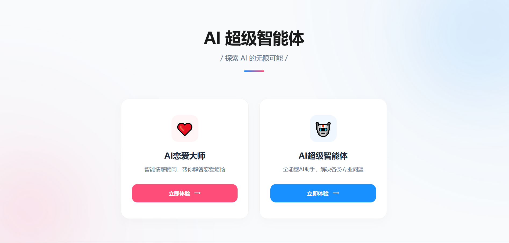
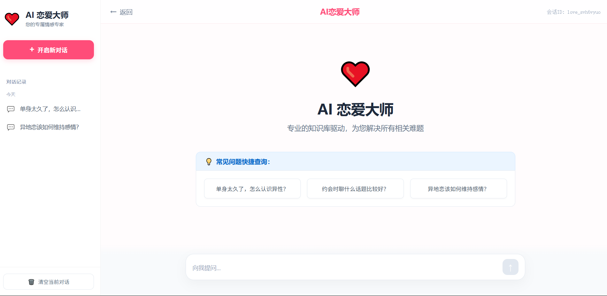
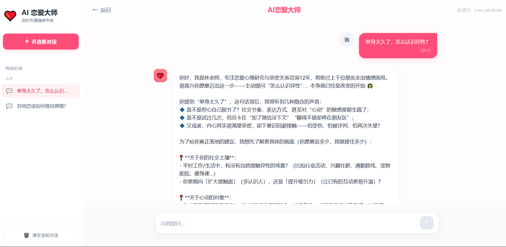
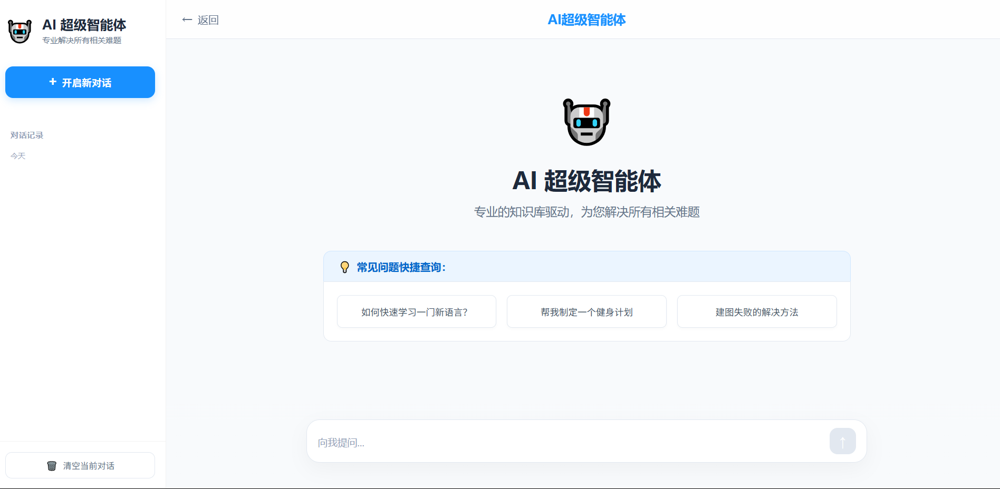
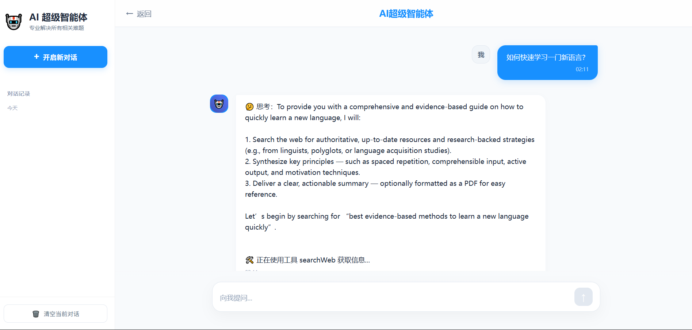

# Yu-AI-Agent 项目（AI 恋爱大师智能体） · 学习笔记

本项目是 **AI 超级智能体** 项目的 Java 前后端部分，学习自 [鱼皮 · 编程导航](https://github.com/liyupi/yu-ai-agent) 的 AI 开发实战课程及[开源代码仓库](https://github.com/liyupi/yu-ai-agent)。
基于 **Spring Boot 3 + Java 21 + Spring AI** 构建了 AI 恋爱大师应用与 ReAct 模式自主规划智能体 YuManus。

[](https://spring.io/projects/spring-boot)
[](https://openjdk.org/)
[](https://spring.io/projects/spring-ai)

---

## 📸 项目预览

### 首页 · AI 智能体选择


### AI 恋爱大师
| 初始界面 | 对话效果 |
|:---:|:---:|
|  |  |

### AI 超级智能体
| 初始界面 | 对话效果 |
|:---:|:---:|
|  |  |

---

## 📂 项目结构

```text
yu-ai-agent/                         # 项目根目录
├── yu-ai-agent-frontend/            # Vue3 前端模块
│   ├── src/                         # 前端源码目录
│   ├── package.json                 # 前端依赖配置
│   ├── vite.config.js               # Vite 构建配置
│   └── nginx.conf                   # Nginx 部署配置
└── yu-ai-agent-backend/             # Java 后端项目模块
    ├── pom.xml                      # 父 POM，管理多模块
    ├── Dockerfile                   # Docker 构建文件
    ├── data/                        # README 示例截图
    ├── yu-ai-agent-admin/           # 核心应用模块
    │   └── src/main/
    │       ├── java/com/yuaiagent/
    │       │   ├── advisor/         # 自定义 Advisor（日志、Re-Reading）
    │       │   ├── agent/           # AI 智能体（BaseAgent → ReActAgent → YuManus）
    │       │   ├── chatmemory/      # 文件持久化对话记忆（Kryo 序列化）
    │       │   ├── config/          # 全局配置（CORS、Tool 注册、RAG）
    │       │   ├── constant/        # 常量定义
    │       │   ├── controller/      # REST API 控制器（AI 对话、健康检查）
    │       │   ├── rag/             # RAG 全链路（文档加载/切割/检索/查询增强）
    │       │   ├── service/         # 业务服务（恋爱大师、超级智能体）
    │       │   └── tools/           # 7 种内置工具
    │       └── resources/
    │           ├── application.yml       # 应用配置
    │           ├── application-druid.yml # Druid 数据源配置
    │           ├── document/             # RAG 知识库文档（恋爱问答 - 单身/恋爱/已婚篇）
    │           └── mcp-servers.json      # MCP 服务端连接配置
    └── yu-image-search-mcp-server/  # MCP 图片搜索服务模块
        └── src/main/
            ├── java/.../tools/ImageSearchTool.java
            └── resources/           # SSE / STDIO 双模式配置
```

---

## ✨ 核心功能

### 1. AI 恋爱大师 (`LoveAppService`)
- **多轮对话**：基于 Spring AI `ChatClient` + 自定义 `Advisor` 实现连贯会话。
- **对话记忆持久化**：使用 `FileBasedChatMemory` + Kryo 序列化，将会话状态落盘。
- **RAG 知识库**：加载恋爱领域 Markdown 文档（单身篇/恋爱篇/已婚篇），经文档切割 → PGVector 向量存储 → 查询增强，实现精准知识问答。
- **结构化输出**：支持生成恋爱报告等结构化 JSON 输出。
- **工具调用 & MCP**：可调用内置工具和外部 MCP 服务辅助回答。

### 2. AI 超级智能体 YuManus (`SuperAgentService`)
- **ReAct 架构**：`BaseAgent → ToolCallAgent → ReActAgent → YuManus` 四层继承体系，实现"思考 → 行动 → 观察"闭环。
- **自主规划**：根据用户需求自主推理并调用多种工具，直至完成目标。
- **SSE 流式输出**：通过 SSE 实时推送智能体推理过程和结果。

### 3. 内置工具集
| 工具 | 说明 |
|---|---|
| `WebSearchTool` | 联网搜索（SearchAPI） |
| `WebScrapingTool` | 网页抓取（Jsoup） |
| `FileOperationTool` | 文件读写操作 |
| `ResourceDownloadTool` | 资源下载 |
| `TerminalOperationTool` | 终端命令执行 |
| `PDFGenerationTool` | PDF 文档生成（iText） |
| `TerminateTool` | 终止智能体执行 |

### 4. MCP 图片搜索服务 (`yu-image-search-mcp-server`)
- 独立模块，支持 **SSE** 和 **STDIO** 两种通信模式。
- 提供从特定网站搜索图片的能力，可被主应用或其他 MCP 客户端调用。

---

## 🛠️ 技术栈

| 分类 | 技术 |
|---|---|
| **框架** | Spring Boot 3.5 + Java 21 |
| **AI 框架** | Spring AI 1.0 + Spring AI Alibaba + LangChain4j |
| **大模型** | 阿里云百炼 DashScope（qwen-plus）/ Ollama 本地模型 |
| **向量数据库** | PGVector（PostgreSQL 扩展） |
| **数据源** | Druid 连接池 |
| **API 文档** | Knife4j (Swagger) |
| **工具库** | Hutool、Jsoup、iText、Kryo |
| **协议** | MCP（Model Context Protocol）|
| **部署** | Docker / Serverless |

---

## 🚀 快速开始

### 1. 环境要求
- **JDK 21+**
- **Maven 3.9+**
- **PostgreSQL + PGVector 扩展**（如使用 RAG/向量存储特性）

### 2. 配置 API Key
编辑 `yu-ai-agent-admin/src/main/resources/application.yml`，替换以下配置：
```yaml
spring:
  ai:
    dashscope:
      api-key: 替换为您的API_KEY  # 阿里云百炼 DashScope

search-api:
  api-key: 替换为您的API_KEY      # SearchAPI 联网搜索
```

### 3. 构建 & 运行
```bash
# 编译打包
mvn clean package -DskipTests

# 启动主应用
java -jar yu-ai-agent-admin/target/yu-ai-agent-admin-0.0.1-SNAPSHOT.jar

# (可选) 启动 MCP 图片搜索服务
java -jar yu-image-search-mcp-server/target/yu-image-search-mcp-server-0.0.1-SNAPSHOT.jar
```

### 4. Docker 部署
```bash
docker build -t yu-ai-agent .
docker run -p 8123:8123 yu-ai-agent
```

### 5. 接口文档
启动后访问 Knife4j 接口文档：
```
http://localhost:8123/api/doc.html
```

---

## 📚 学习大纲

本项目覆盖以下核心知识点（对应原课程 9 期内容）：

1. **AI 大模型接入** — API / SDK / Spring AI / Ollama 本地部署
2. **Prompt 工程** — 提示词优化技巧与模板
3. **Spring AI 核心特性** — ChatClient、Advisor、ChatMemory、结构化输出
4. **RAG 知识库** — 文档 ETL → 向量存储 → 检索增强 → 全链路调优
5. **向量数据库** — PGVector 集成与配置
6. **Tool Calling** — 工具定义、注册与自动调用
7. **MCP 协议** — 服务开发、SSE/STDIO 通信、安全实践
8. **AI Agent** — ReAct 模式、自主规划智能体开发
9. **AI 服务化** — SSE 接口、Serverless 部署

---

## 📜 声明

- **学习用途**：本仓库仅用于个人学习与笔记整理，无任何商业用途。
- **非官方代码**：本项目与鱼皮 / 编程导航官方无直接关联，仅参考其公开课程内容进行实践。
- **欢迎扩展**：你可以在此基础上继续扩展自己的 AI Agent 实战项目与实验。
